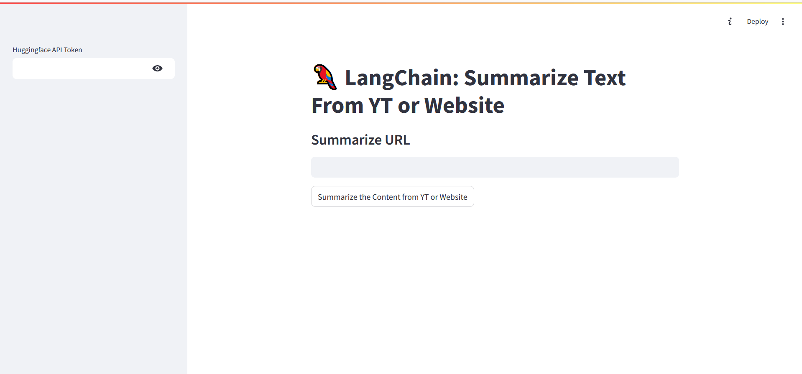

---

# LangChain: Summarize Text From YouTube or Website

This is a **Streamlit app** that utilizes **LangChain** to summarize text content from a YouTube video or a website URL. It leverages the power of HuggingFace models for generating summaries based on the input content, with optional integration for Groq API (currently using HuggingFace's `Mistral-7B-Instruct` model).

## Features

- Summarize content from YouTube videos or website URLs.
- Flexible use of HuggingFace's summarization model (`Mistral-7B-Instruct`).
- User-friendly Streamlit interface for input and interaction.
- Validation of URLs and API tokens before generating summaries.

## Requirements

To run this app, you need the following:

- Python 3.10 or higher
- HuggingFace API token
- Libraries:
  - `langchain`
  - `streamlit`
  - `langchain_groq`
  - `langchain_huggingface`
  - `validators`
  - `langchain_community`
  - `UnstructuredURLLoader` (LangChain Community)

## Setup Instructions

1. **Clone the Repository**:
   ```bash
   git clone <repo-url>
   cd <repo-directory>
   ```

2. **Install Dependencies**:
   Create a virtual environment and install the required packages:
   ```bash
   python -m venv venv
   source venv/bin/activate  # On Windows use `venv\Scripts\activate`
   pip install -r requirements.txt
   ```

3. **Create a HuggingFace API Token**:
   Go to [HuggingFace](https://huggingface.co/settings/tokens) and create an API token if you don't have one.

4. **Run the Application**:
   Start the Streamlit app by running the following command:
   ```bash
   streamlit run main.py
   ```

## Usage

1. Launch the app using Streamlit.
2. Input your HuggingFace API token in the sidebar.
3. Enter a valid YouTube video URL or a website URL in the provided input field.
4. Click **"Summarize the Content from YT or Website"** to generate a summary of the content.

## Code Structure

- **app.py**: Main file containing the Streamlit app logic and UI components.
- **LangChain Integration**: 
  - **HuggingFaceEndpoint**: Used to access the `Mistral-7B-Instruct` model for summarization.
  - **YoutubeLoader** and **UnstructuredURLLoader**: Load content from YouTube and websites respectively.
  - **PromptTemplate**: Custom prompt for generating text summaries.
  - **Summarization Chain**: The LangChain summarization chain loads documents and generates the output using the defined LLM.

## Example

 

1. Enter the HuggingFace API token and a valid URL (YouTube or website).
2. Hit the **Summarize** button.
3. Get a 300-word summary of the content in the Streamlit interface.

## License

This project is licensed under the MIT License. See the [LICENSE](LICENSE) file for details.

---
